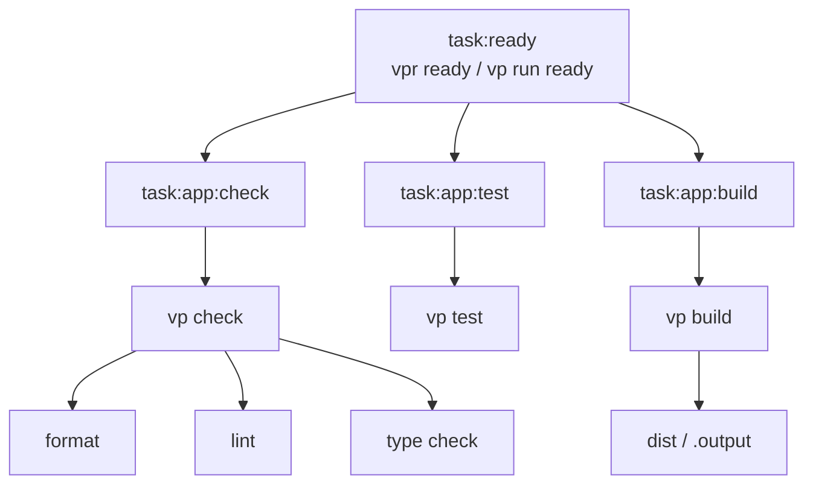

# vp-react-start

A React application starter built with [Vite+](https://viteplus.dev/guide/), [TanStack Start](https://tanstack.com/start/latest/docs/framework/react/build-from-scratch), [TanStack Router](https://tanstack.com/router/latest/docs/api/router/RouterOptionsType), [Nitro](https://nitro.build/docs), [Tailwind CSS](https://tailwindcss.com/docs/installation/using-vite), [React Compiler](https://react.dev/learn/react-compiler/installation), TypeScript, and Vitest.

This template is intentionally minimal. It includes app infrastructure, routing, metadata helpers, CI, and tooling defaults without adding a styled example app.

## Stack

- [React 19](https://react.dev)
- [TanStack Start](https://tanstack.com/start/latest/docs/framework/react/build-from-scratch)
- [TanStack Router](https://tanstack.com/router/latest/docs/api/router/RouterOptionsType)
- [TanStack Router Devtools](https://tanstack.com/router/latest/docs/devtools)
- [Nitro](https://nitro.build/docs)
- [React Compiler](https://react.dev/learn/react-compiler/installation)
- [Tailwind CSS v4](https://tailwindcss.com/docs/installation/using-vite)
- [Base UI](https://base-ui.com)
- [Tabler Icons](https://tabler.io/icons)
- [TypeScript](https://www.typescriptlang.org)
- [Vite+](https://viteplus.dev/guide/)
- [Vitest](https://vitest.dev/guide/)
- [OXC](https://oxc.rs/docs/guide/usage/linter/config.html) linting and formatting through Vite+
- pnpm catalogs

## Requirements

Use the Node version supported by `package.json`. CI runs with Node 24, so Node 24 is the safest local default.

Install dependencies with Vite+:

```sh
vp install
```

## Commands

Vite+ runs package scripts and configured tasks through `vp run`. The `vpr` command is the shorthand for `vp run`.

```sh
# Start the dev server
vpr dev

# Format files
vpr fmt

# Lint files
vpr lint

# Run format, lint, and type checks
vpr check

# Run tests
vpr test

# Build the app
vpr build

# Run the full local readiness check
vpr ready
```

Use `vpr ready` before committing changes.

## Project Structure

```txt
src/
  lib/
    seo.ts
    utils.ts
  routes/
    __root.tsx
    index.tsx
  routeTree.gen.ts
  router.ts
  site.config.ts
  styles.css

tooling/
  format.ts
  lint.ts
  patterns.ts
  plugins.ts
  tasks.ts
  test.ts

.github/
  workflows/
    ready.yml
  pull_request_template.md

components.json
package.json
vite.config.ts
tsconfig.json
tsconfig.base.json
pnpm-workspace.yaml
```

## Routing

TanStack Router is configured in `src/router.ts`.

The router enables:

- intent-based route preloading
- structural sharing
- scroll restoration

The root route lives in `src/routes/__root.tsx`. It owns the document shell, root error fallback, root not-found fallback, global CSS import, and development-only router devtools.

`src/routeTree.gen.ts` is generated by TanStack Router/Start. It is committed so the template is immediately inspectable and type-checkable after install, but it is excluded from formatting, linting, and Vite+ task cache inputs.

Relevant docs:

- [TanStack Start: Build a Project from Scratch](https://tanstack.com/start/latest/docs/framework/react/build-from-scratch)
- [TanStack Start: CSS Styling](https://tanstack.com/start/latest/docs/framework/react/guide/css-styling)
- [TanStack Router: Router Options](https://tanstack.com/router/latest/docs/api/router/RouterOptionsType)
- [TanStack Router: Document Head Management](https://tanstack.com/router/latest/docs/guide/document-head-management)
- [TanStack Router: Scroll Restoration](https://tanstack.com/router/latest/docs/guide/scroll-restoration)
- [TanStack Router: Render Optimizations](https://tanstack.com/router/latest/docs/guide/render-optimizations)
- [TanStack Router: Devtools](https://tanstack.com/router/latest/docs/devtools)

## Styling

Tailwind CSS is configured through `src/styles.css` and the Tailwind Vite plugin.

`src/lib/utils.ts` includes a `cn()` helper using `clsx` and `tailwind-merge`.

The template does not include a styled app shell. Route placeholders are intentionally plain.

Relevant docs:

- [Tailwind CSS: Installing with Vite](https://tailwindcss.com/docs/installation/using-vite)
- [TanStack Start: CSS Styling](https://tanstack.com/start/latest/docs/framework/react/guide/css-styling)

## Component Generation

`components.json` is configured for shadcn-style component generation.

The template uses:

- TypeScript and TSX components
- Tailwind CSS through `src/styles.css`
- `#/*` path aliases
- `cn()` from `src/lib/utils.ts`
- Tabler Icons as the icon library
- Base UI as the installed primitive dependency

Replace or extend `components.json` when a project chooses a stronger component convention.

Relevant docs:

- [shadcn: components.json](https://ui.shadcn.com/docs/components-json)
- [Base UI](https://base-ui.com)
- [Tabler Icons](https://tabler.io/icons)

## Metadata

Site defaults live in `src/site.config.ts`.

Replace these values when starting a real project:

- `name`
- `title`
- `description`
- `url`
- `image`

The SEO helper in `src/lib/seo.ts` derives canonical URLs, Open Graph metadata, and Twitter card metadata from the site config and route path.

The default image path is `/og-image.png`. Add a matching public asset or update the path before using the template in production.

Relevant docs:

- [TanStack Router: Document Head Management](https://tanstack.com/router/latest/docs/guide/document-head-management)

## Tooling

`vite.config.ts` is the composition point. Focused config lives under `tooling/`:

- `tooling/format.ts` owns formatting config.
- `tooling/lint.ts` owns lint config.
- `tooling/patterns.ts` owns generated and output path patterns.
- `tooling/plugins.ts` owns the Vite plugin pipeline.
- `tooling/tasks.ts` owns the Vite+ task graph.
- `tooling/test.ts` owns Vitest config.

### Task Graph



Vite+ provides the local workflow:

- `vp install` installs dependencies using the detected workspace package manager.
- `vpr` is shorthand for `vp run`.
- `vp run` executes package scripts and configured tasks.
- `vp check` runs formatting, linting, and type checking together.
- `vp fmt` formats files.
- `vp lint` lints files.
- `vp test` runs Vitest without staying in watch mode by default.
- `vp build` runs the Vite production build through Vite+.

Runtime plugins such as TanStack Start and Nitro are skipped in test mode. React, React Compiler, and Tailwind transforms still run for tests.

Relevant docs:

- [Vite+: Getting Started](https://viteplus.dev/guide/)
- [Vite+: Installing Dependencies](https://viteplus.dev/guide/install)
- [Vite+: Run](https://viteplus.dev/guide/run)
- [Vite+: Check](https://viteplus.dev/guide/check)
- [Vite+: Format](https://viteplus.dev/guide/fmt)
- [Vite+: Lint](https://viteplus.dev/guide/lint)
- [Vite+: Test](https://viteplus.dev/guide/test)
- [Vite+: Build](https://viteplus.dev/guide/build)
- [Vite+: Task Caching](https://viteplus.dev/guide/cache)
- [Vite+: IDE Integration](https://viteplus.dev/guide/ide-integration)
- [Vite+: Continuous Integration](https://viteplus.dev/guide/ci)
- [Vite+: Composing Configuration Files](https://viteplus.dev/guide/monorepo#composing-configuration-files)
- [OXC: Linter Configuration](https://oxc.rs/docs/guide/usage/linter/config.html)
- [Vitest: Getting Started](https://vitest.dev/guide/)
- [React Compiler: Installation](https://react.dev/learn/react-compiler/installation)

## CI

The Ready workflow runs on pull requests, pushes to `main`, and manual dispatch.

It uses Vite+ to:

1. install dependencies
2. restore the Vite+ task cache and build output
3. run `vp run ready`

Build output is restored with the task cache because generated output directories are excluded from task inputs.

Local verification should use:

```sh
vpr ready
```

Relevant docs:

- [Vite+: Continuous Integration](https://viteplus.dev/guide/ci)
- [Vite+: Task Caching](https://viteplus.dev/guide/cache)

## Deployment

Nitro is wired through `nitro/vite`.

No Nitro preset is forced, and no deployment-specific production start script is included. Choose the preset and runtime script when a project picks a hosting target.

Relevant docs:

- [TanStack Start: Hosting](https://tanstack.com/start/latest/docs/framework/react/guide/hosting)
- [Nitro: Introduction](https://nitro.build/docs)

## Template Checklist

When using this template for a real project:

- update `package.json` name
- update `src/site.config.ts`
- add or replace `public/og-image.png`
- replace the home route placeholder
- style or replace root error and not-found fallbacks
- choose a deployment target and Nitro preset if needed
- update this README for the real project
